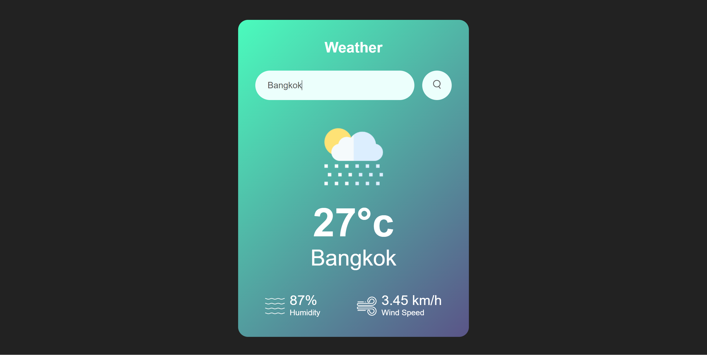

# Weather App

Welcome to **Weather App**! 🌦️

  

## Overview

Weather App is a simple and stylish web application that allows you to check the weather for any location around the world. With its user-friendly interface and beautiful design, you can quickly get the weather information you need. Just enter the name of a city, hit the search button, and you'll receive up-to-date weather details in an instant.

## How to Use

1. **Search Box**: Type the name of the city you want to check the weather for in the input field. The auto-suggest feature will help you find your desired location faster.

2. **Search Button**: Click the search button (or press Enter) to fetch the weather data for the specified city.

3. **Weather Icon**: A visual representation of the current weather conditions in the city.

4. **Temperature**: The temperature in degrees Celsius.

5. **City Name**: The name of the city for which you are checking the weather.

6. **Humidity**: The humidity percentage in the air.

7. **Wind Speed**: The wind speed in kilometers per hour.

## Supported Weather Conditions

Abeer Weather App provides icons and information for various weather conditions:

- ☀️ Clear
- 🌧️ Rain
- 🌦️ Drizzle
- 🌧️ Showers
- ❄️ Snow
- 🌫️ Mist
- 🌥️ Cloudy

## Stylish Design

The app features a modern and eye-catching design with a gradient background that changes colors dynamically. The clean layout and elegant fonts make it a pleasure to use.

## Credits

This weather app is powered by the OpenWeatherMap API to provide you with accurate and real-time weather data.

## Get Started

To use Abeer Weather App, you will need an internet connection. Simply open the HTML file in your web browser, and you're good to go!

## Feedback

If you have any suggestions or encounter any issues while using Abeer Weather App, please don't hesitate to get in touch with us.

Enjoy checking the weather with **Abeer's Weather App**! 🌍🌦️🔍

---

*Note: This readme is for illustrative purposes and may require adjustments to work effectively in your project's context.*
